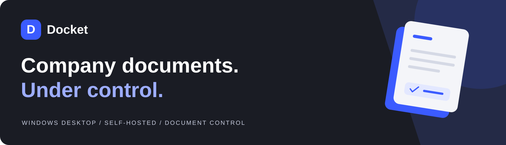

<div align="center">



**A familiar desktop workspace for company files, document versions, and controlled sharing.**

Windows desktop · Self-hosted server · Java 21

[**Request a demo →**](https://github.com/senanqulamov/File-Manager-App/issues/new?template=demo-request.yml) · [Product tour](docs/PRODUCT-TOUR.md) · [Try locally](docs/QUICKSTART.md) · [Commercial enquiries](docs/COMMERCIAL.md)

</div>

<br>


<sub>Product design preview. The gallery uses supplied design references, not a recording of a tested release. Current desktop and installer builds carry PMIS Docket branding.</sub>

## Keep the work. Keep the history.

Docket brings file browsing, document control, and IT administration into one desktop application. Teams work with personal files and company folders, reserve documents for editing, and check changes back in with a version comment.

The server runs on infrastructure managed by your organisation. It stores document content and metadata centrally; the desktop connects through the application API.

| For your team | For your IT administrator |
| :--- | :--- |
| Browse files with a familiar Explorer-style interface | Manage accounts and company-folder permissions |
| Check documents out, edit in a desktop app, then check them in | Review access requests and recorded activity |
| Revisit earlier versions and share with selected colleagues | Manage user quotas, deleted items, and client updates |
| Preview supported formats and use document tools in one place | Operate the database and storage on your own infrastructure |

## One workspace, from file to finished document

**01 · Find and open**

Move between Home, My files, Company, and Shared with me. Browse in grid or details view, filter by file type, and inspect a file in the preview pane.

**02 · Edit with a history**

Check out a document to work in its associated desktop application. Check it back in with a comment, inspect previous versions, or restore an earlier version as a new one.

**03 · Prepare and share**

Convert supported formats, sign PDFs, apply a stamp, or password-protect a file. Share personal items with named colleagues and an optional expiry date.

<table>
<tr>
<td width="50%"><br><strong>Follow the changes.</strong> Versions with author, date, and comments.</td>
<td width="50%"><br><strong>Manage access.</strong> Company-folder permissions for people and groups.</td>
</tr>
</table>

[Explore the full product tour →](docs/PRODUCT-TOUR.md)

## What is implemented

| Area | Capabilities in the source |
| :--- | :--- |
| File workspace | Upload, download, folders, rename, move, copy, search in the current folder, recycle bin |
| Document history | Check-out/check-in, comments, version listing and restoration |
| Sharing | Personal file/folder sharing, view or edit access, expiry dates |
| Document tools | Supported conversions, PDF digital signing, password protection, unlocking, stamps |
| Administration | Users, folder ACLs, access requests, audit search/export, server statistics, update upload |
| Distribution | Windows packaging scripts, bundled Java runtime, configurable server address |

Office previews and selected document operations require **LibreOffice on the server**. Media conversions require **FFmpeg**. Editing a checked-out file requires an appropriate application on the PC. See the [capability and dependency details](docs/PRODUCT-TOUR.md).

## Evaluate Docket

**For a company evaluating the product:** [request a demo](https://github.com/senanqulamov/File-Manager-App/issues/new?template=demo-request.yml). Describe your team size and document workflow without sharing confidential information. Scope, deployment, support, and commercial terms are agreed directly with the maintainer.

**For an authorised technical evaluation:** install JDK 21 and Maven 3.9+, then run these scripts in separate windows on a Windows PC:

```bat
run-server-local.cmd
run-desktop.cmd
```

Connect to `http://localhost:8080`. Demo user: `a.karimova`; demo password: `Docket2026!`. For the administrator view, use `r.aliyev` with the same demo password. Use sample documents only and keep the demo server on an isolated machine or network.

[Full quick start and troubleshooting →](docs/QUICKSTART.md)

## Deployment at a glance

| Component | Role |
| :--- | :--- |
| JavaFX desktop | Windows user interface and connection to the server |
| Spring Boot server | Authentication, file operations, document tools, and administration |
| PostgreSQL | Production metadata, accounts, permissions, versions, and audit records |
| Server storage | Document blobs, signing keys, and uploaded client installers |
| Optional tools | LibreOffice for Office operations; FFmpeg for media conversion |

[Installation guide](docs/INSTALL.md) · [Architecture](docs/ARCHITECTURE.md) · [Release process](docs/RELEASING.md)

## Current stage

**Pre-release software for controlled evaluation.** Implemented features are not a claim of production certification. Production database and HTTPS deployment, permission boundaries, concurrent editing, large files, backup restoration, and Windows installer behaviour still require release validation. Repository build checks do not replace those tests.

Signing uses Docket-generated certificates; external identity trust requires a separate certificate arrangement. The audit log is application-level history, not a tamper-proof compliance archive. The installer is not currently publisher-signed.

[Read the readiness checklist and known limitations →](docs/STATUS.md)

## Documentation

| Start here | Reference |
| :--- | :--- |
| [Product tour](docs/PRODUCT-TOUR.md) | Screens and supported workflows |
| [Commercial enquiries](docs/COMMERCIAL.md) | Demo, evaluation, deployment, and licensing discussions |
| [Quick start](docs/QUICKSTART.md) | Run the local sample environment |
| [Installation](docs/INSTALL.md) | Prepare a controlled server deployment |
| [Support](SUPPORT.md) | Report a problem or ask a question |
| [Security](SECURITY.md) | Report a security concern privately |
| [Contributing](CONTRIBUTING.md) | Development and review conventions |

---

**Docket** · Created by [Senan Qulamov](https://github.com/senanqulamov)

Commercial software. All rights reserved. Public source visibility does not grant an open-source licence. See [COPYRIGHT.txt](COPYRIGHT.txt) and [commercial enquiries](docs/COMMERCIAL.md).
