<div align="center">


# PMIS Docket

**A file server and document control system for your company, in one desktop app.**

Browse your office server like Windows Explorer, then check out, version, share, convert, sign, lock and stamp documents, with every action recorded in the audit log.


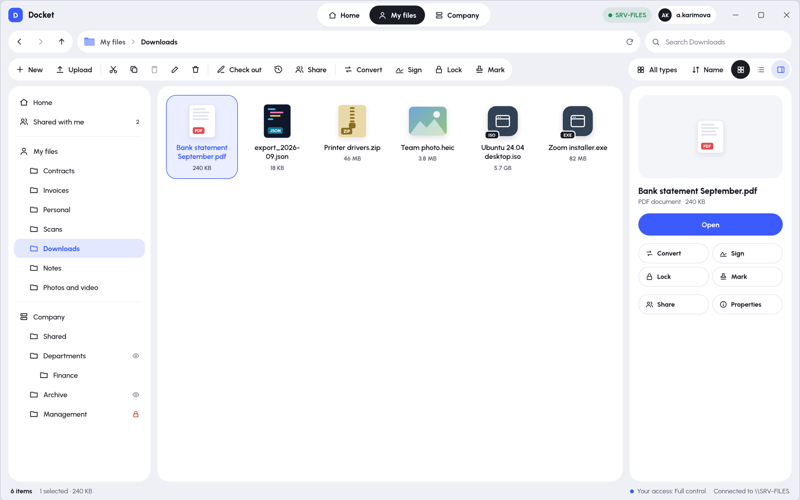

</div>

---

## Why Docket

Shared network drives give you folders, but no control. People overwrite each other's files, nobody knows which version is the latest, and IT can't tell who opened what.

Docket keeps the familiar Explorer feel and adds the document control companies need:

- **Your server, your data.** Everything is stored on your own Windows server. There is no cloud and no subscription to a third-party service.
- **Feels like Explorer.** Back, forward and up, a path bar, large icons or details, drag and drop, and the keyboard shortcuts people already know.
- **Real document control.** Check-out and check-in, full version history, signatures, password protection, stamps and an audit trail that can't be edited.
- **Permissions without Active Directory.** IT manages users and folder access in a built-in admin console.

---

## Features

### Explorer for your company server

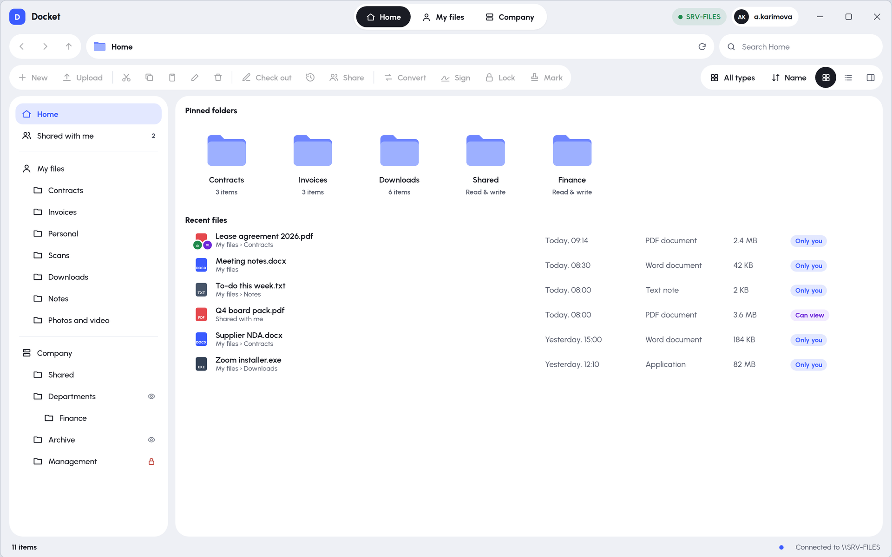

- **Four places to work:** **Home** (recent files and items shared with you), **My files** (each person's private folder), **Company** (shared folders with permissions per folder) and **Shared with me**.
- **Browsing:** grid and details views, sort by name, date, type or size, a type filter (documents, images, videos, audio, text and code, archives) and search inside the current folder.
- **File operations:** new folder, upload with the button or by dragging files in, download, cut, copy, paste, rename, and delete with **Undo**.
- **Preview pane:** shows the selected file with its status and quick actions.
- **Clear permissions:** read-only folders and locked items show it, and every disabled button explains why when you click it.

### Viewer for every file type

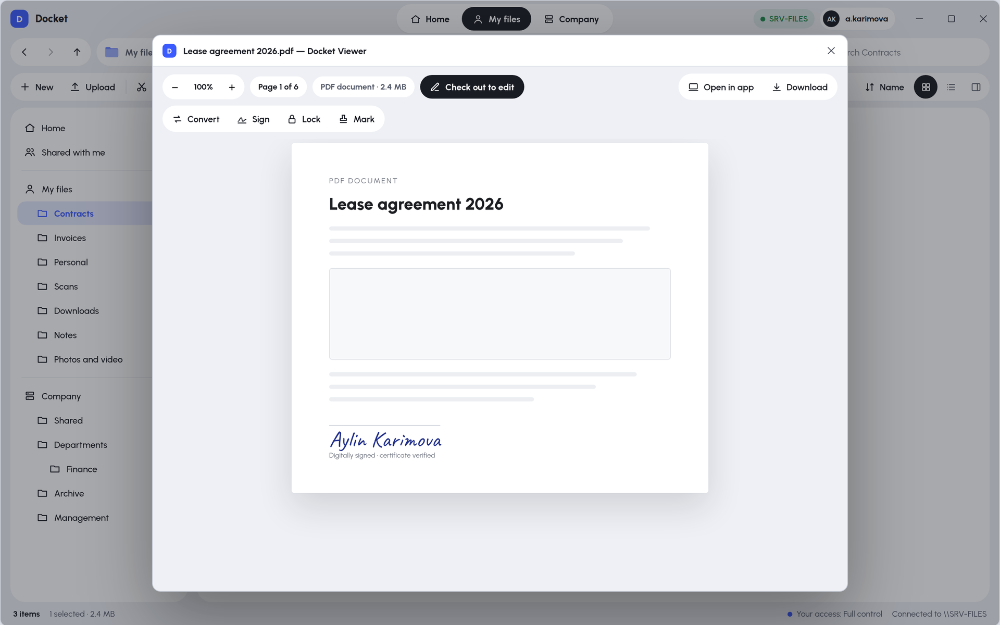

Files open inside Docket. Nothing needs installing on the PC to look at them.

| Type | What you see |
|---|---|
| PDF, Word, Excel, PowerPoint | Pages, with zoom and page navigation |
| Pictures (PNG, JPG, GIF, BMP, WebP) | The picture, with zoom |
| Video and audio (MP4, M4A, MP3, WAV) | A built-in player |
| Text and code | A read-only text or code view |
| ZIP, 7z, TAR archives | The list of contents, with **Extract here** |
| Anything else | A clear card with **Open with…** and **Download** |

### Check-out, check-in and versions

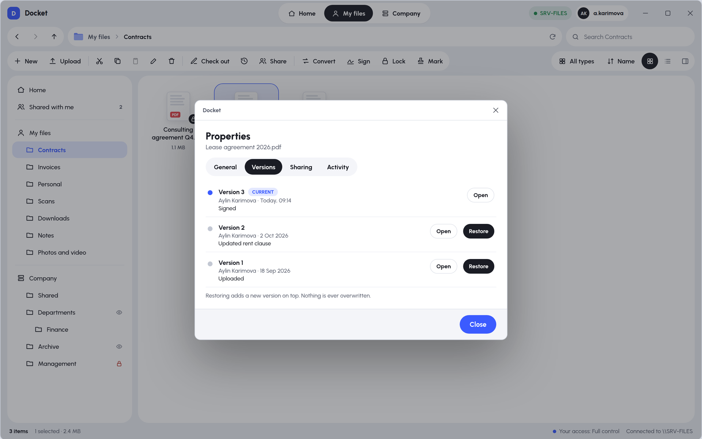

- **Check out** opens the file in Word, Excel or any other desktop app. Colleagues see *"Editing: Aylin K."* and can open the file, but can't change it.
- **Check in** with a comment saves a new version. Docket knows whether you actually changed the file.
- **Version history** shows who saved each version, when and why. You can open any old version or restore it as a new one; nothing is ever overwritten.

### Convert, Sign, Lock and Stamp

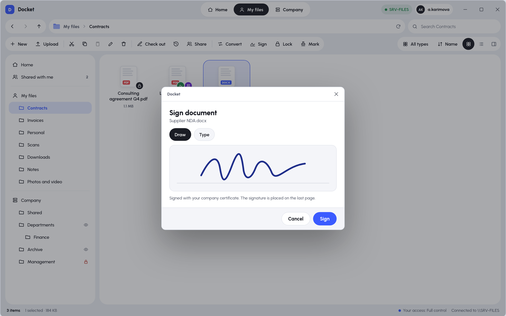 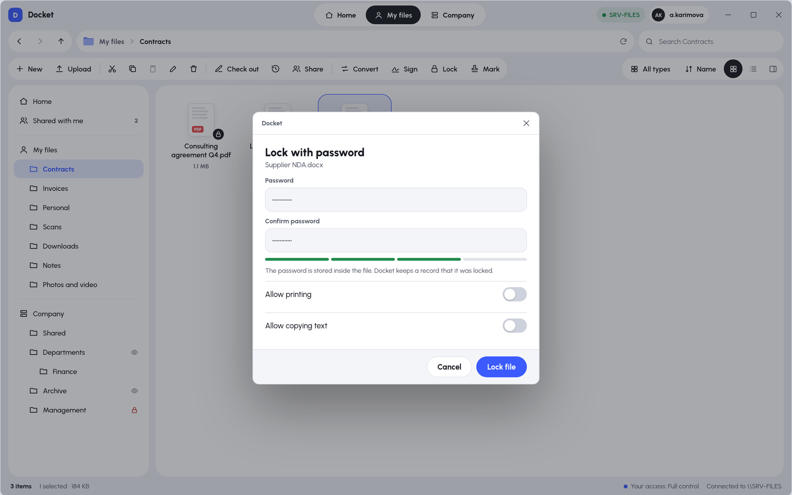

- **Convert.** Word, Excel and PowerPoint to PDF, PDF to Word, images or text, pictures to PDF, PNG or JPG, CSV to Excel, video to MP4, MP3 or GIF, and audio to MP3 or WAV. Docket offers only the formats that make sense for each file.
- **Sign.**
  - You can draw your signature or type it. It is placed on the last page, the first page or every page.
  - The visible signature is combined with a real digital signature (PKCS#7) using each user's personal certificate.
  - Office files are signed as a PDF copy.
- **Lock.**
  - AES-256 password protection. PDFs get print and copy permissions; Word, Excel and PowerPoint files use Office's own encryption.
  - Other files are wrapped in an encrypted ZIP.
  - **Unlock** removes the password again. Docket never stores the password.
- **Stamp.** Approved, Confidential, Draft, Copy, Paid, Rejected, or your own text, on PDFs and pictures.

### Share with colleagues

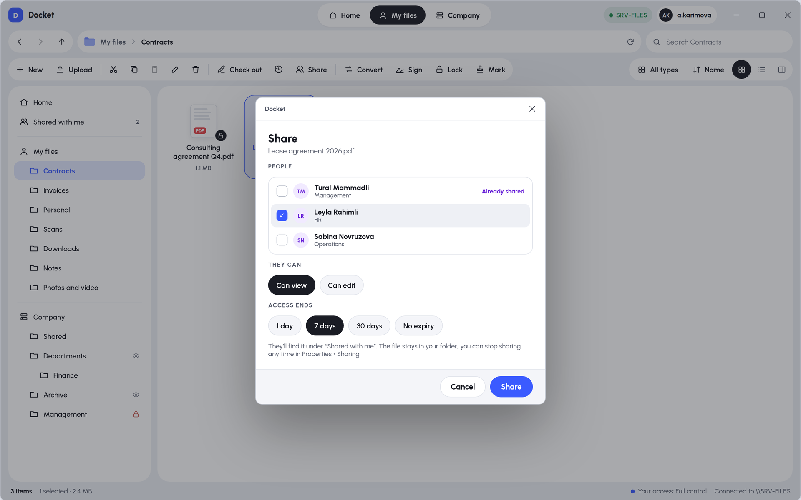

- Share any file or folder from **My files** with chosen colleagues, either **Can view** or **Can edit**.
- Set when access ends: 1 day, 7 days, 30 days or never.
- People find shared items under **Shared with me**. You can stop sharing at any time.

### Admin console for IT

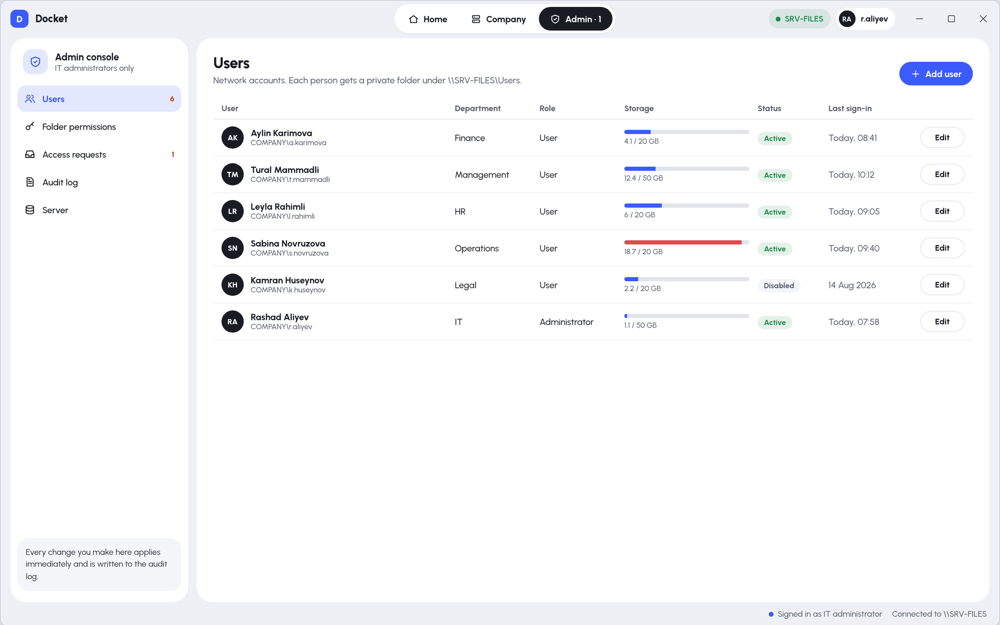

- **Users.** Add people (a temporary password is shown once), edit department, storage quota and role, disable accounts (which signs them out at once), reset passwords and delete users. When you delete someone, you can hand their files to a colleague.
- **Folder permissions.** For every company folder, choose *No access*, *Read only*, *Read & write* or *Full control* for groups and individual people. Folders inherit from their parent unless they have their own settings.
- **Access requests.** People who are refused access to a folder can ask for it, and IT approves or denies with one click.
- **Audit log.** Every open, edit, share, delete, permission change and sign-in is recorded. You can filter, search and export to CSV, and entries can't be edited.
- **Server.** Disk use, users, files being edited, pending requests, and whether the conversion tools are installed.
- **Recycle Bin.** Restore anything deleted, or empty items older than 30 days.
- **App updates.** Upload a new installer, and every PC offers it at the next sign-in.

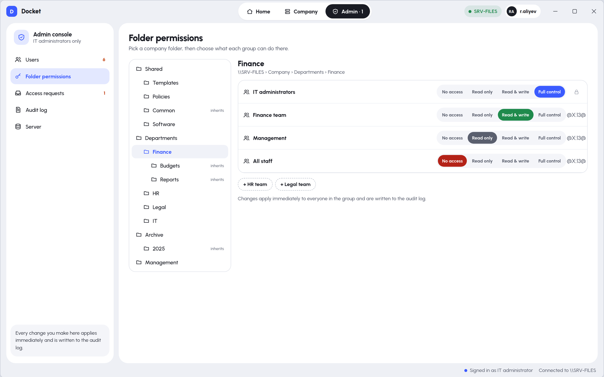 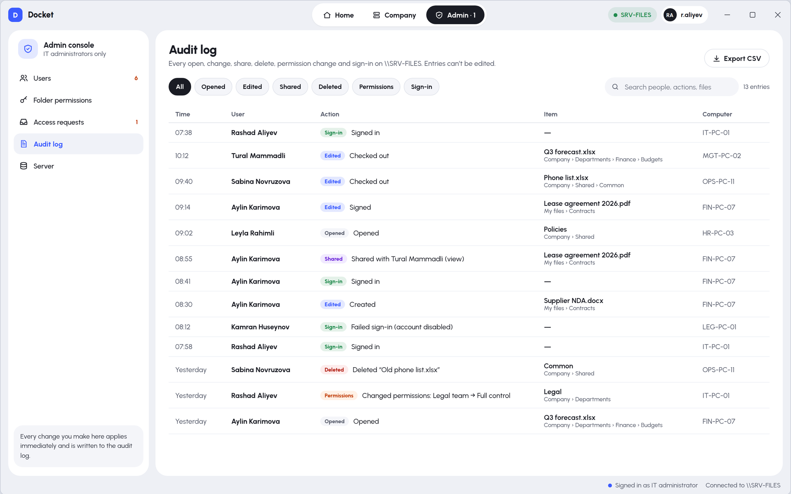

### Sign-in and installer

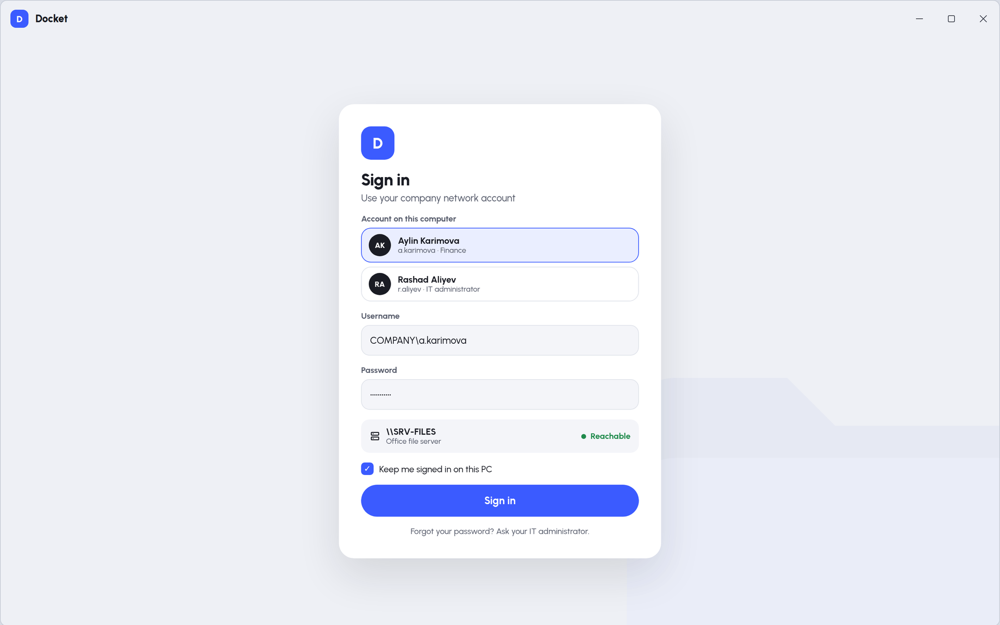 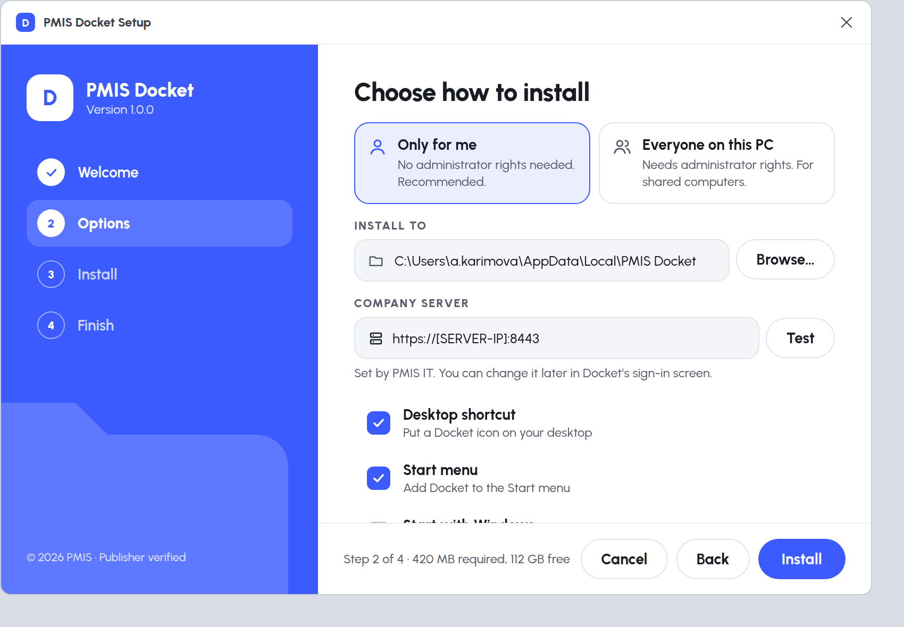

- **Sign-in:** a server reachability check, and a forced password change for new accounts and resets.
- **Windows installer:** includes its own Java, so nothing else needs installing on the PCs. It comes with the server address preset and supports silent install for IT.

---

## How it works

```
 Desktop app (each PC)  ──HTTPS──▶  Docket Server  ──▶  PostgreSQL (metadata, users, audit)
   JavaFX 21                          Spring Boot 3   ──▶  Storage folder on the server's disk
                                                      ──▶  LibreOffice / FFmpeg (optional, conversions)
```

- **Only the server touches the storage disk.** PCs never get direct access to the files, so permissions can't be bypassed through Windows Explorer.
- **Files are stored safely.** Content is stored once and never overwritten. Versions, copies and renames don't duplicate data.
- **Permissions are checked twice.** The app checks them so it can explain what's allowed, and the server checks them again on every request.

---

## Requirements

**Server**
- Windows Server 2019 or newer (Linux also works)
- Java 21
- PostgreSQL 16 or newer
- Optional: **LibreOffice** for Office previews, conversions, and signing or stamping Office files
- Optional: **FFmpeg** for video and audio conversion

**PCs**
- Windows 10 or 11
- The installer includes Java, so nothing else is needed

---

## Quick start: try it on one PC

You need JDK 21 and Maven 3.9 or newer.

1. Double-click **`run-server-local.cmd`**. This starts a test server with demo data at http://localhost:8080.
2. Double-click **`run-desktop.cmd`**.
3. Sign in with any demo account. The password for all of them is **`Docket2026!`**

| Username | Role | Try this |
|---|---|---|
| `a.karimova` | Finance | My files with every file type, sharing, sign, lock and stamp |
| `t.mammadli` | Management | A file checked out by him, and items shared with him |
| `r.aliyev` | IT administrator | The admin console |

To start again with fresh demo data, run `reset-demo-data.cmd`.

## Installing for real

See the **[installation guide](docs/INSTALL.md)**. It covers PostgreSQL setup, the HTTPS certificate, server environment variables, running Docket as a Windows service, creating the first administrator, building the installer and backups.

---

## Licence and purchase

PMIS Docket is commercial software. The source code in this repository is provided to licensed customers.

| | **Standard** | **Business** |
|---|---|---|
| Users | Up to [N] | Unlimited |
| Full source code | ✓ | ✓ |
| Installer branded with your company name | ✓ | ✓ |
| Updates for | [12 months] | [12 months] |
| Installation help | Email | Remote session |
| Price | [price] | [price] |

**To buy a licence or book a demo:** [your email] · [your website]

---

## Support

- **Bugs and questions:** [your email or issue link]
- **Response time:** [e.g. within 1 business day]

<div align="center">

Made by **PMIS** · © 2026 PMIS. All rights reserved.

</div>
