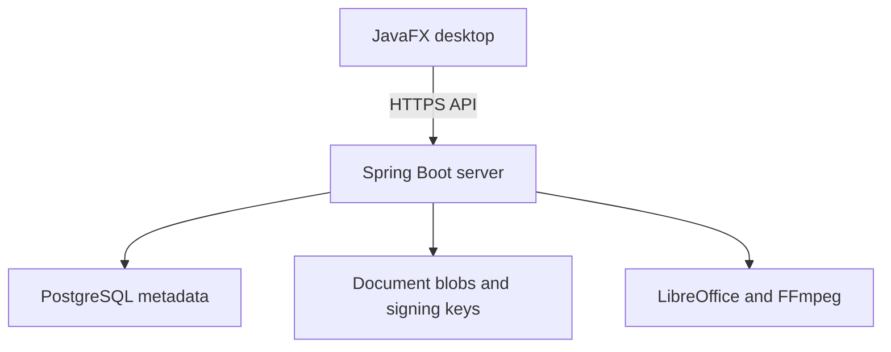

# Architecture

Docket has two Maven modules: a JavaFX desktop application and a Spring Boot HTTP server. The desktop calls the server API; it does not directly connect to PostgreSQL or mount the storage directory.

## Responsibility boundaries

| Component | Responsibility |
| --- | --- |
| `desktop/` | Sign-in, file workspace, viewer, admin UI, API client, local editing copies |
| `server/` | Authentication, authorisation, metadata, document processing, audit, client updates |
| `installer/` | jpackage app image, Inno Setup packaging, server-address configuration |
| PostgreSQL | Users, sessions, nodes, versions, ACLs, shares, requests, audit records |
| Storage root | Blob content, per-user signing keystores, published client installer |

Local evaluation uses H2 instead of PostgreSQL. Production selects the `prod` Spring profile. Java packages in this repository are rooted at `com.pmis.docket`; the handover archive used `com.docket`.

## File and version model

A node identifies a root, folder, or file and its parent. File content is stored using blob keys. A new file version points to its corresponding blob; earlier version rows preserve the historical references. Copying can reuse a blob while creating another node. Database and storage backups must therefore remain consistent.

The desktop uses local working copies for external editing. Check-out state lives on the server, and check-in creates a version when content is submitted. Concurrency and permission revocation during these operations need the tests listed in [status](STATUS.md).

## Access model

- Personal-space owners have full control; active shares grant other users read or write access.
- Company folders use ACL entries for users, groups, and all staff, with inherited rules.
- Administrators manage company access and accounts through admin endpoints.
- The server validates bearer sessions and active users. Default session lifetime is twelve hours.

These are intended implementation rules, not a completed security assessment. The pre-release access-control review includes recursive operations and session/password behaviour.

## Trust and operations

The server and database administrators are trusted operators. Audit records are database-backed application history, not an independently tamper-evident ledger. Signing keys are maintained on the server. Password-protecting individual documents does not encrypt all stored data.

Document conversion invokes optional server tools. Resource limits, untrusted input handling, and representative format compatibility belong in deployment validation.

[Installation](INSTALL.md) · [Security](../SECURITY.md) · [Back to Docket](../README.md)
